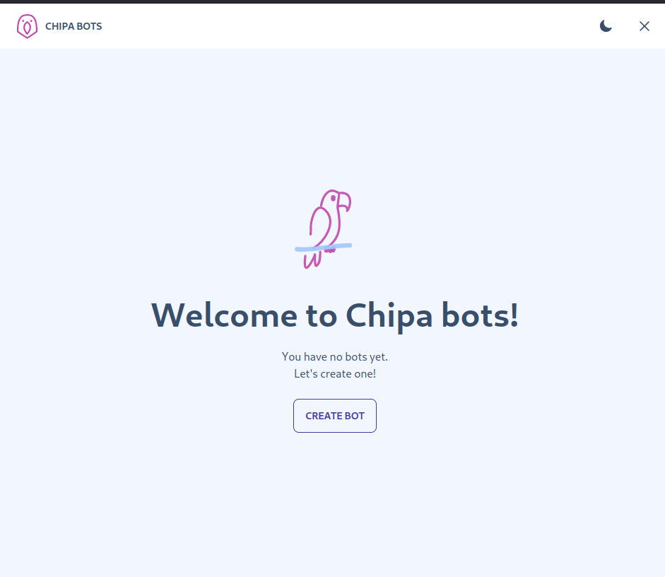
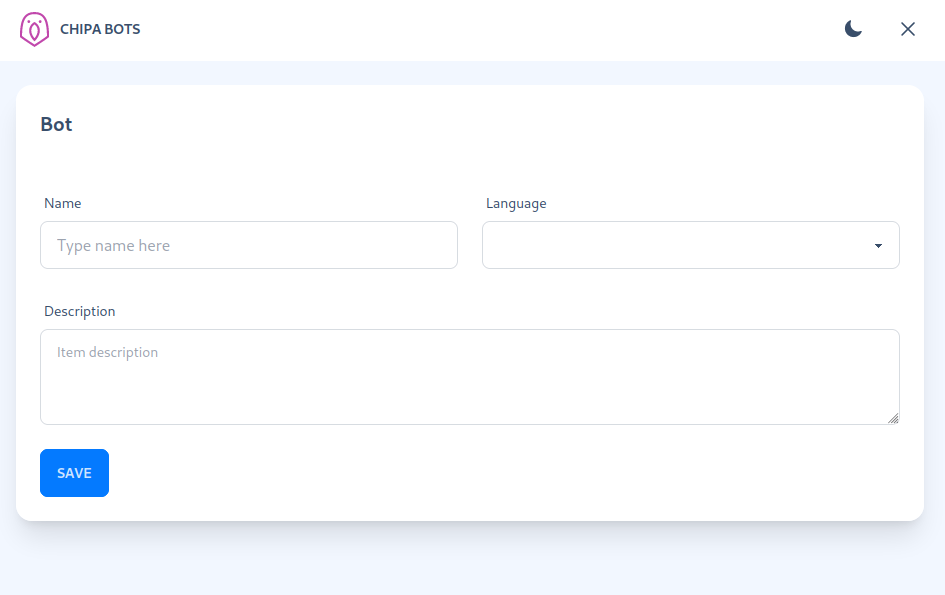
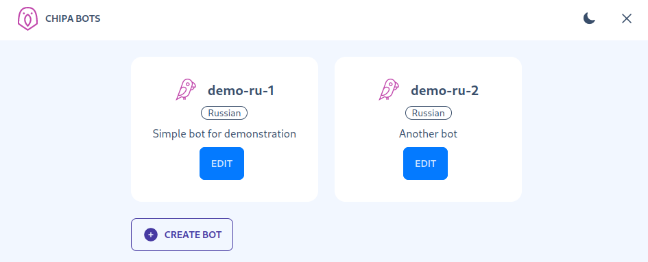
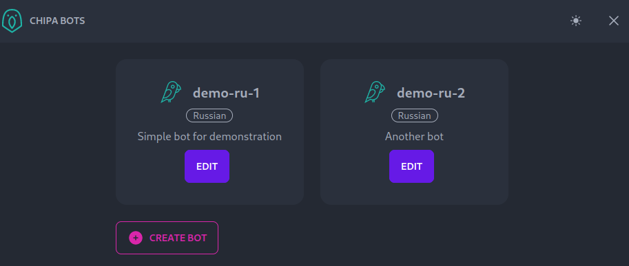

# Overview

Web UI for https://chipa.archertech.ru

user: demo
pass: demo

Project blog: https://archertech.ru/projects/chipa/, frontend app post: https://archertech.ru/posts/2023-06-12-front-dev-insights

See screenshots below.

Based on https://github.com/achernetsov/daisyui-vue-admin-minimal

# Features
- Vue, Vite, Typescript, Vue-Router, Pinia store
- [Daisyui](https://daisyui.com) components (hero, cards, forms)
- Responsive layout
- Dark / light theme toggle with [theme-change](https://github.com/saadeghi/theme-change)
- Form with tabs; tabs implemented using Vue router nested routes; state displayed within tabs located in Pinia store
- [Hero icons](https://github.com/tailwindlabs/heroicons)
- Keycloak integration on https://www.npmjs.com/package/keycloak-js
- API integration

# How to bootstrap dev environment

Disable keycloak in .env.development:

```
VITE_KEYCLOAK_ENABLED=false
```

Bootstrap API mock:

```shell
npm run api
```

Bootstap app:

```shell
npm run dev
```

## With keycloak

Enable keycloak in .env.development:

```
VITE_KEYCLOAK_ENABLED=true
```

Bootstrap keycloak using docker-compose:

```
docker-compose up -d
```

Bootstrap API mock:

```shell
npm run api
```

Bootstap app:

```shell
npm run dev
```

# Screenshots





# Original vite instructions

## Recommended IDE Setup

[VSCode](https://code.visualstudio.com/) + [Volar](https://marketplace.visualstudio.com/items?itemName=Vue.volar) (and disable Vetur) + [TypeScript Vue Plugin (Volar)](https://marketplace.visualstudio.com/items?itemName=Vue.vscode-typescript-vue-plugin).

## Type Support for `.vue` Imports in TS

TypeScript cannot handle type information for `.vue` imports by default, so we replace the `tsc` CLI with `vue-tsc` for type checking. In editors, we need [TypeScript Vue Plugin (Volar)](https://marketplace.visualstudio.com/items?itemName=Vue.vscode-typescript-vue-plugin) to make the TypeScript language service aware of `.vue` types.

If the standalone TypeScript plugin doesn't feel fast enough to you, Volar has also implemented a [Take Over Mode](https://github.com/johnsoncodehk/volar/discussions/471#discussioncomment-1361669) that is more performant. You can enable it by the following steps:

1. Disable the built-in TypeScript Extension
    1) Run `Extensions: Show Built-in Extensions` from VSCode's command palette
    2) Find `TypeScript and JavaScript Language Features`, right click and select `Disable (Workspace)`
2. Reload the VSCode window by running `Developer: Reload Window` from the command palette.

## Customize configuration

See [Vite Configuration Reference](https://vitejs.dev/config/).

## Project Setup

```sh
npm install
```

### Compile and Hot-Reload for Development

```sh
npm run dev
```

### Type-Check, Compile and Minify for Production

```sh
npm run build
```

### Lint with [ESLint](https://eslint.org/)

```sh
npm run lint
```
